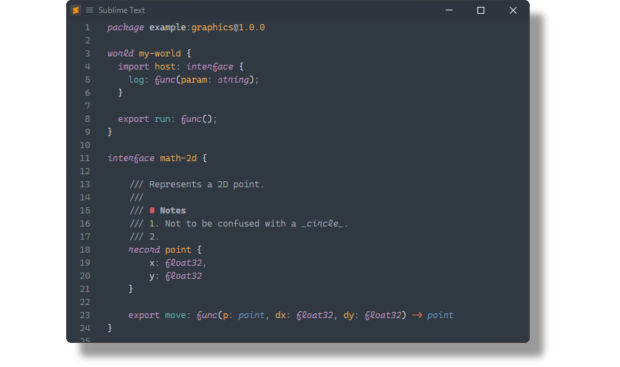

# WASM Interface Type

[WASM Interface Type](https://github.com/WebAssembly/component-model/blob/main/design/mvp/WIT.md) syntax for [Sublime Text](https://www.sublimetext.com).

## Installation

### Package Control

The easiest way to install is using [Package Control](https://packagecontrol.io). It's listed as `WASM Interface Type`.

1. Open `Command Palette` using <kbd>ctrl+shift+P</kbd> or menu item `Tools → Command Palette...`
2. Choose `Package Control: Install Package`
3. Find `WASM Interface Type` and hit <kbd>Enter</kbd>

### Manual Install

1. Download [WASM.Interface.Types.sublime-package](https://github.com/SublimeText/WasmInterfaceType/releases) for your Sublime Text build.
2. Rename it to _WASM Interface Type.sublime-package_
2. Copy it into _Installed Packages_ directory

> [!NOTE]
>
> To find _Installed Packages_...
>
> 1. call _Menu > Preferences > Browse Packages.._
> 2. Navigate to parent folder
